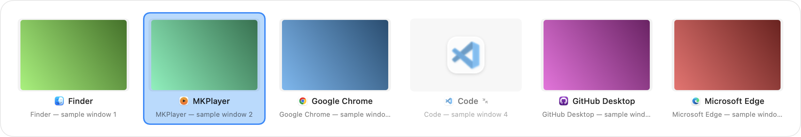

# AltTab

A Windows-style Alt+Tab window switcher for macOS. Native Swift / AppKit / SwiftUI,
runs as a menu-bar background utility.

Hold **⌥ Option** and press **Tab** to bring up a centred overlay of every open
window — not just every app — with live thumbnails, application icons, names and
window titles. Keep holding Option to cycle; release it to switch.



---

## Install

1. Download **`AltTab.zip`** (or `AltTab.dmg`).
2. Extract it (double-click).
3. Drag **`AltTab.app`** into **/Applications**.
4. Launch it. A setup window appears.
5. Grant **Accessibility** — click *Open Accessibility Settings*, then switch on
   **AltTab** under *Privacy & Security → Accessibility*. AltTab starts listening
   as soon as the switch flips; no relaunch needed.
6. Grant **Screen Recording** (optional) the same way, under
   *Privacy & Security → Screen Recording*. macOS requires a **relaunch** after
   granting this one. Without it AltTab falls back to application icons instead of
   window thumbnails — everything else still works.
7. Make sure **Enable Alt+Tab** is ticked in the menu-bar menu.
8. Try it with Chrome, Finder, Terminal and VS Code open. Two Chrome windows show
   as two separate entries.

### "AltTab can't be opened because Apple cannot check it for malicious software"

The app is ad-hoc signed, not notarised (that requires a paid Apple Developer ID —
see *Code signing* below). To open it anyway:

- **Right-click** `AltTab.app` → **Open** → **Open** in the dialog, **or**
- *System Settings → Privacy & Security*, scroll to the bottom, click
  **Open Anyway** next to the AltTab message.

You only have to do this once.

---

## Keyboard

| Keys | Action |
|---|---|
| **⌥ Tab** | Open the switcher / select the next window |
| **⌥ ⇧ Tab** | Select the previous window |
| **⌥** held + **Tab** | Keep cycling |
| Release **⌥** | Activate the selected window |
| **← → ↑ ↓** | Navigate the grid |
| **Return** | Activate the selected window |
| **Esc** | Close without switching |

All three shortcuts are rebindable in *Settings → Keyboard*. The switcher stays
open for as long as the modifier of the **Next window** shortcut is held.

## Ordering

Windows are ordered most-recently-used, not alphabetically. Index 0 is the window
you are in now, index 1 is the one you were in before — so a quick ⌥Tab tap flips
between your last two windows, exactly like Windows.

`Chrome → VS Code → Terminal → Chrome` ⇒ the next ⌥Tab selects **Terminal**.

## Settings

Menu-bar icon → **Settings…**

- **General** — Enable Alt+Tab, Launch at Login, Show menu-bar icon, live
  permission status
- **Behavior** — Include minimized windows, Include windows from all Spaces,
  Show window titles, Show application icons
- **Appearance** — Preview size, Theme (System/Light/Dark), Background blur,
  Background opacity, Corner radius
- **Keyboard** — Next / Previous / Cancel shortcut recorders

---

## Verifying the install

The app ships with a self-test. Run it from the installed bundle so macOS sees the
same code identity you granted permissions to:

```sh
/Applications/AltTab.app/Contents/MacOS/AltTab --self-test ~/Desktop
```

It checks grid geometry, MRU ordering and shortcut handling, renders the overlay
offscreen to `~/Desktop/switcher-preview.png`, then reports live permission status,
enumerates your real windows and captures a real thumbnail.

For a trace of what the switcher is doing:

```sh
ALTTAB_DEBUG=1 /Applications/AltTab.app/Contents/MacOS/AltTab
```

---

## Building from source

Requires Xcode 16 or newer, macOS 14+.

```sh
./build.sh
```

Produces `dist/AltTab.app` (universal arm64 + x86_64, ad-hoc signed),
`dist/AltTab.zip` and `dist/AltTab.dmg`.

To work on it in Xcode, open **`Package.swift`** — Xcode treats a Swift package as
a first-class project with a build/run scheme (`AltTab`). `xcodebuild -scheme
AltTab -configuration Release build` works too. There is no `.xcodeproj` file
because a generated one would be a redundant second source of truth for the same
target; `swift package generate-xcodeproj` has been deprecated by Apple since
Xcode 13 for exactly this reason.

### Layout

```
AltTab/
├── App/                 main, AppDelegate, menu-bar item, self-test
├── WindowManagement/    window model, AX enumeration, MRU, focus tracking, activation
├── Preview/             ScreenCaptureKit thumbnail cache
├── Input/               CGEventTap global keyboard monitor
├── Permissions/         Accessibility / Screen Recording detection + setup UI
├── UI/                  floating panel, SwiftUI overlay, grid geometry
├── Settings/            preferences model, settings window, shortcut recorder
└── Utilities/           AXUIElement helpers, debug logging
```

### APIs used

| Need | API |
|---|---|
| Window enumeration | Accessibility (`AXUIElementCopyAttributeValue`, `kAXWindowsAttribute`) |
| Window previews | **ScreenCaptureKit** (`SCShareableContent`, `SCScreenshotManager.captureImage`) |
| Window activation | Accessibility (`kAXRaiseAction`, `kAXMinimizedAttribute`, `kAXFrontmostAttribute`) |
| Global keyboard | `CGEvent.tapCreate` on a dedicated thread |
| Focus / MRU tracking | `AXObserver` + `NSWorkspace` notifications (event-driven, no polling) |
| Displays | `NSScreen` |
| Launch at login | `SMAppService` |

Accessibility is used for enumeration rather than `CGWindowListCopyWindowInfo`
because it is the only API that reports minimized windows and windows on other
Spaces *and* can act on them. `CGWindowList` is used once, at launch, purely to
seed an initial z-order for the MRU list.

### Performance

- Nothing is captured or polled while the switcher is closed — idle CPU measures
  **0.0%**, resident memory ~70 MB.
- The window list is kept warm by focus/launch/quit notifications, so the overlay
  paints from cache on the first frame and reconciles asynchronously.
- Thumbnails are cached per window id and re-captured only when older than 4s;
  the cache is capped at 80 entries and pruned when windows disappear.

---

## Code signing

`build.sh` **ad-hoc signs** the bundle (`codesign --sign -`). That is enough to
run it on your own Mac and to be granted TCC permissions, and it needs no Apple
Developer account.

It is **not** Developer ID signed or notarised — that requires a paid Apple
Developer Program membership and Apple's notary service, neither of which is
available in a build environment. Practical consequences:

- Gatekeeper shows the "unidentified developer" warning on first open (see above).
- The ad-hoc identity is a hash of the binary, so **rebuilding the app invalidates
  its Accessibility and Screen Recording grants**. After replacing the app, remove
  the old AltTab entry in *Privacy & Security* with the **–** button and re-add it.

## Known macOS limitations

- **Secure input.** While a password field has secure input enabled (login
  windows, some password managers), macOS blocks all event taps and ⌥Tab will not
  fire. This affects every third-party switcher; there is no supported workaround.
- **Screen Recording is required for thumbnails.** There is no API to read window
  contents without it. Denied, AltTab shows application icons — deliberately, not
  as an error.
- **Minimized windows cannot be captured.** A minimized window has no surface in
  the window server, so its tile shows the last cached thumbnail if there is one,
  otherwise the app icon, with a badge. Selecting it de-miniaturises, raises and
  activates it.
- **`_AXUIElementGetWindow`.** Mapping an accessibility window to its window-server
  id has no public API. AltTab uses this long-standing private symbol, as every
  macOS window switcher does. It is fine for personal use but would be rejected by
  the Mac App Store.
- **Full-screen Spaces.** Activating a window that lives in its own full-screen
  Space triggers the standard macOS Space-switch animation; that delay is the
  system's, not AltTab's.
- **Non-`.regular` apps are excluded** by design — that is what keeps the Dock,
  menu bar, wallpaper and background helpers out of the list.
